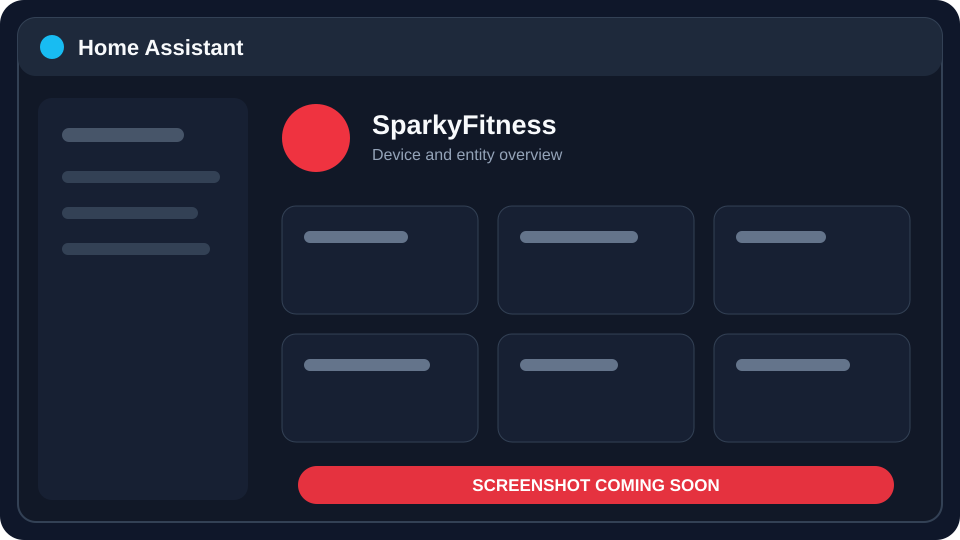
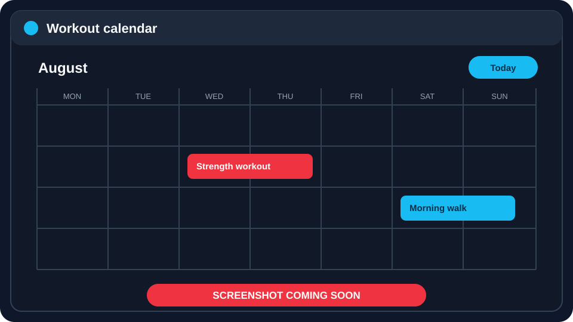
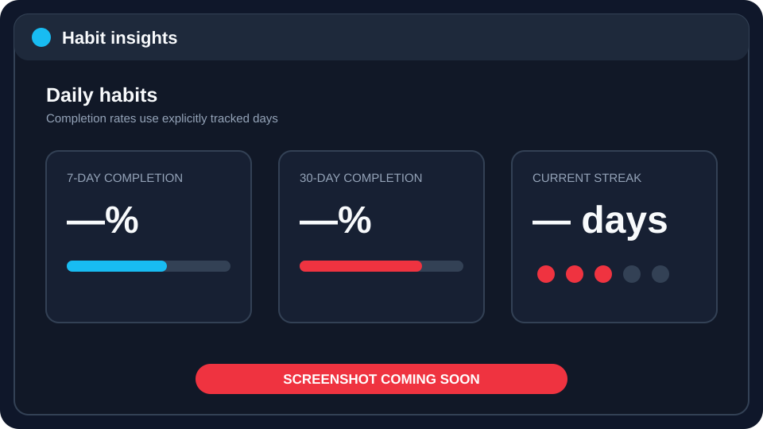
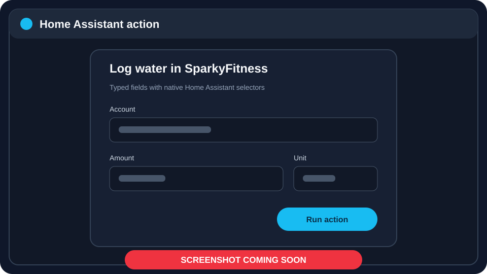

<p align="right">
  <a href="README.de.md">Deutsch</a> · <strong>English</strong>
</p>

<p align="center">
  
</p>

<h1 align="center">SparkyFitness for Home Assistant</h1>

<p align="center">
  Bring your self-hosted fitness data into Home Assistant — directly over MCP,
  without a cloud relay or an LLM.
</p>

<p align="center">
  <a href="https://github.com/JensRudolph/sparkyfitness-custom-integration/releases/latest"></a>
  <a href="https://github.com/JensRudolph/sparkyfitness-custom-integration/actions/workflows/validate.yml"></a>
  
  
  <a href="LICENSE"></a>
</p>

> [!IMPORTANT]
> Your API key and health data travel only between Home Assistant and the
> SparkyFitness MCP endpoint you configure. The integration has no telemetry,
> cloud backend, LLM dependency, database access, or private REST fallback.

## See it in Home Assistant

| Device and entities | Workout calendar |
|:---:|:---:|
|  |  |
| *Device overview — screenshot coming soon* | *Read-only workout calendar — screenshot coming soon* |

| Habit insights | Action dialog |
|:---:|:---:|
|  |  |
| *Optional completion and streak sensors — screenshot coming soon* | *Typed actions with native selectors — screenshot coming soon* |

## What you get

| Observe | Automate | Stay private |
|---|---|---|
| Nutrition, hydration, check-ins, goals, trends, fasting, habits, and workouts | Log weight, water, food, exercise, sleep, mood, habits, goals, and fasting from HA | Direct, asynchronous Streamable HTTP MCP using Home Assistant's shared HTTP session |
| Native sensors, binary sensors, diagnostics, and a workout calendar | Safe update/delete actions use exact diary IDs and explicit confirmation | API keys never appear in logs, diagnostics, entities, or action responses |
| Independent polling sections preserve healthy data during partial failures | Multiple API keys and SparkyFitness accounts are supported | No guessing, scraping, cloud relay, third-party analytics, or generic MCP escape hatch |

## Quick start

1. In SparkyFitness, create a personal API key under
   **Settings → Developer & Integrations → API Key Management**.
2. In HACS, add
   `https://github.com/JensRudolph/sparkyfitness-custom-integration`
   as a custom **Integration** repository and install **SparkyFitness**.
3. Restart Home Assistant, then open
   **Settings → Devices & services → Add integration → SparkyFitness**.
4. Enter your SparkyFitness base URL or `/mcp` endpoint and the API key.

The setup flow initializes MCP, discovers the server's tools, validates the key,
and creates only entities supported by that SparkyFitness installation.

[Full installation guide](docs/installation.md) ·
[Configuration guide](docs/configuration.md) ·
[Troubleshooting](docs/troubleshooting.md)

## Feature highlights

- UI-only setup, options, reconfiguration, and API-key reauthentication.
- Runtime MCP tool discovery instead of assuming every server has every feature.
- Five-minute coordinated polling by default, configurable from 1–60 minutes.
- Demand-aware polling skips sections that have no enabled consuming entity.
- Partial failures remain isolated and recover automatically.
- Native read-only workout calendar using bounded exercise-diary requests.
- Dynamic habit completion and streak entities with bounded, cached history reads.
- Current goals and structured 30-day health and fitness trends.
- Exact, reviewed Home Assistant actions — never a generic “call any tool” action.
- Multiple accounts or users, including multiple API keys for the same server.
- Optional technical diagnostics without personal health values.
- English and German UI and entity translations.

## A small automation example

Forward a valid smart-scale value directly to SparkyFitness:

```yaml
automation:
  - alias: "Weight to SparkyFitness"
    triggers:
      - trigger: state
        entity_id: sensor.smart_scale_weight
    conditions:
      - condition: template
        value_template: >
          {{ trigger.to_state.state not in ['unknown', 'unavailable'] }}
    actions:
      - action: sparkyfitness.log_weight
        data:
          weight: "{{ trigger.to_state.state | float }}"
          unit: kg
```

More examples are available in the [automation cookbook](docs/automations.md).

## Documentation

| Guide | Contents |
|---|---|
| [Documentation index](docs/README.md) | Start here for the complete documentation |
| [Installation](docs/installation.md) | Requirements, API keys, HACS, manual installation, and upgrades |
| [Configuration](docs/configuration.md) | Setup, feature options, multiple accounts, TLS, and reauthentication |
| [Entities](docs/entities.md) | Sensors, binary sensors, diagnostics, units, and availability |
| [Actions](docs/actions.md) | Every Home Assistant action and its reviewed MCP mapping |
| [Automation cookbook](docs/automations.md) | Ready-to-adapt YAML examples |
| [Workout calendar](docs/workout-calendar.md) | Calendar ranges, time zones, refreshes, and privacy |
| [Habits](docs/habits.md) | Daily state, 7/30-day completion, streaks, and caching |
| [Security and privacy](docs/security-and-privacy.md) | Data flow, diagnostics, secrets, and threat boundaries |
| [Troubleshooting](docs/troubleshooting.md) | Connection, TLS, authentication, missing entities, and repairs |
| [Compatibility](docs/compatibility.md) | Verified MCP behavior and known upstream limitations |
| [Architecture](docs/architecture.md) | Coordinator, capability discovery, polling, and error isolation |
| [Development](docs/development.md) | Local setup, testing, validation, and releases |
| [Changelog](CHANGELOG.md) | User-visible changes by release |

## Requirements

- Home Assistant 2026.8.0 or newer.
- A current SparkyFitness release with its Streamable HTTP MCP endpoint.
- A personal SparkyFitness API key.
- Network access from Home Assistant to the SparkyFitness host.

See [MCP compatibility](docs/compatibility.md) for the verified upstream baseline
and deliberate limitations.

## Installation through HACS

Until this repository is included in the HACS default catalog:

1. Open HACS and choose **Custom repositories** from the three-dot menu.
2. Add this repository URL and select the **Integration** category.
3. Install **SparkyFitness** and restart Home Assistant.

Manual installation and update instructions are in the
[installation guide](docs/installation.md).

## Security at a glance

```text
Home Assistant
      │
      │  Streamable HTTP MCP + Bearer API key
      ▼
Configured SparkyFitness /mcp endpoint
```

The integration never stores diary/history payloads in entity attributes.
Calendar reads are bounded to the requested range, and habit analytics retain
only compact derived values. See [Security and privacy](docs/security-and-privacy.md).

## Support and releases

- [Latest release](https://github.com/JensRudolph/sparkyfitness-custom-integration/releases/latest)
- [Changelog](CHANGELOG.md)
- [Open an issue](https://github.com/JensRudolph/sparkyfitness-custom-integration/issues)
- [Validation workflows](https://github.com/JensRudolph/sparkyfitness-custom-integration/actions)

Release tags are published only after the complete mocked test suite, coverage
gate, Ruff, HACS validation, and Home Assistant hassfest validation pass.

## License

[MIT](LICENSE)

The SparkyFitness name and brand icon belong to the upstream SparkyFitness
project; the icon is included only to identify this integration in Home
Assistant and HACS.
